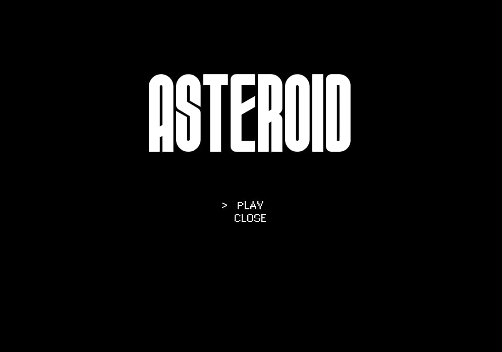
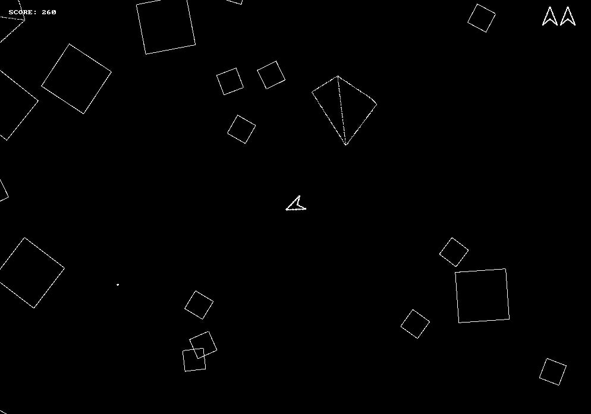

# Introduction

<p align="center">
  
  
</p>

A clone of the classic Asteroids arcade game—though a few things still need polishing.

This little project is a way for me to revisit high school math (mainly trigonometry and vectors), while also challenging myself to learn C and get comfortable with procedural programming.  
The result? A plate of spaghetti code, served with a side of learning.

# Installation

## 🐧 Linux
```bash
sudo pacman -S allegro
make
```
## Windows:
- Idk, install Linux
